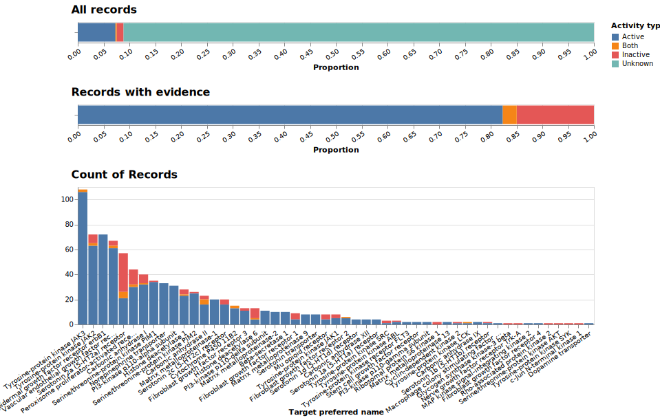

# molrec
##### Predicting ligands without structure-bias using recsys
---

Structure-based and ligand-based virtual screening tools have seen some wins but are either very [brute force](https://www.nature.com/articles/s41586-019-0917-9) or highly [baised to existing structures](https://pubs.acs.org/doi/10.1021/acs.jcim.7b00403). In addition, it's common in the field to use classification-based machine learning, which relies on explicitly labelled positive and negative classes. The realities of _in vitro_ screening mean we only have access to positive labels, so the assumption that an absent label is negative is known _a priori_ to be untrue. Network-based approaches, such as recommender systems, are: 1) aware of missing labels, and 2) can even perform without any information about molecular structure, potentially achieving scaffold hops more often.

## Blurb

This project uses network-based approaches - like recommender systems - and asks how well they perform with or without molecular structure. We ran these algorithms through two validation tasks:

- 1-NN classifier. This is a basic baseline for structure-based techniques
- Label correlation. This is a network-based approach that uses the number of shared labels (the 'label correlation') between pairs of proteins to predict new labels
- Similarity Ensemble Algorithm. This is like label correlation, but uses molecular similarity instead of shared labels tlso predict new labels
- Bayesian Personalized Recommendation (BPR; implicit library). A recommender system that embeds users and items (proteins and ligands) based on their labels.
- Weighted Approximate Rank Pairwise (WARP; LightFM library). A recommender system that embeds users and items (proteins and ligands) based on their labels.
- WARP + fingerprints. The WARP algorithm above but using "metadata" - i.e. molecular structure.

## Results

For the results, see below. We used leave-one-out cross validation (which is appropriate because there can be no structure bias if we only use the label graph as input) to show that a technique using the percentage correlation between labels to calculate probabilities of new the correct label has a median ranking of 1 (panel A), i.e. perfect ranking, and predicts the correct target for any given multi-label ligand 76% of the time in the top three targets, i.e. a p@3 of 0.76 (panel C).

Next, we scraped PubChem data for assays for the top 10,000 probability interactions. Most had no evidence yet, but approximately 30% had some data to indicate activity. Of those, above 80% had 'Active' records, which far exceeded our expectations. Thus we suggest this technique can be used to find low-hanging fruit in the label graph of ChEMBL.

To do:
- [x] write readme - complete 16-12-19
- [x] upload small dataset and parsing script - complete 16-12-19
- [x] create a common assessment task to compare any method on the 243-target subset. This will be the objective function for HPO. - complete 16-12-19
- [x] `implicit` hyperparameter optimization - complete 17-12-19
- [x] `lightfm` hyperparameter optimization - complete 17-12-19
- [ ] ~~`surprise` hyperparameter optimization~~
- [x] convert label correlation approach to use sparse matrices
- [x] show that optimizing for wide vs long is equivalent or not equivalent. complete 22-01-2020
  _It is better to do long_!
- [ ] ~~determine what sklearn ranking loss returns in the event of a zero-vector~~ Not relevant for mean rank or p@k. 
- [ ] ~~decide on the ultimate scoring function. p@k? mean rank of test labels? What about inspection bias?~~ Answer: p@k is useful more for the long-format input data (with axis=1 ranking). But this isn't how we want to use the results! Best to just keep mean rank, or compare the CDF. 
- [x] compare `label correlation`, `implicit-bpr`, `implicit-als`, and `lightfm-warp`, `lightfm-bpr` algorithms using time-split. Must output figures and data.
- [ ] ~~calculate number of known negatives (if any) predicted by best technique from above~~
- [x] upload large dataset and parsing script 25/01/2020
- [x] determine top predictions for target of interest 29/01/2020
- [ ] filter for 'bad' substructures, PAINS, toxicity, etc.
- [ ] determine nearest approved molecules
- [ ] compare nearest approved molecules to those predicted by similarity search with known ligands
- [ ] alternative to approved drugs --> optimize both rank and Tanimoto distance to known ligands

This requires explicit interaction data, i.e. ligand affinity values. Harry?:
- [ ] [optional] [keras hyperparameter optimization](https://www.onceupondata.com/2019/02/10/nn-collaborative-filtering/)
